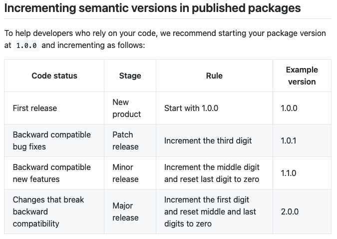

# Frodo Release Pipeline

The Frodo project uses a fully automated release [pipeline](../.github/workflows/pipeline.yml) based on GitHub workflows:


## Releasing Frodo

This information is only actionable if you are an active contributor or maintainer with appropriate access to the repository and need to understand how frodo releases work.

### Every Push Triggers A Release

Frodo adopted the principle of continuous integration. Therefore every push to the main branch in the [rockcarver/frodo] repository trigger the automated release pipeline.

The pipeline determines the type of release - `prerelease`, `patch`, `minor`, `major` - for the push:

-   Scans the commit and PR comments for trigger phrases:
    -   `PATCH RELEASE` triggers a `patch` release
    -   `MINOR RELEASE` triggers a `minor` release
    -   `MAJOR RELEASE` triggers a `major` release
    -   Everything else triggers a `prerelease`
-   Bumps the version accordingly:<br>
    `<major>`.`<minor>`.`<patch>`-`<prerelease>`
-   Updates the [changelog](../CHANGELOG.md) file in [keep a changelog](https://keepachangelog.com/en/1.0.0/) format:
    -   Creates a new release heading using the bumped version and a date stamp
    -   Moves the content of the `Unreleased` section into the new section
    -   Adds release details links

```
❗❗❗ IMPORTANT ❗❗❗
Contributors are instructed to submit pull requests. Maintainers must make sure none of the commit comments nor the PR comment contain trigger phrases that would cause the pipeline to perform an undesired version bump and release.
```

### Automatic Pre-Releases During Iterative Development

The default release type (if no specific and exact trigger phrases are used) results in a pre-release. Pre-releases are flagged with the label `Pre-release` on the [release page](../releases) indicating to users that these releases are not considered final or complete.

Pre-releases are a great way to get the latest and greatest functionality but they are not fully polished, readme and changelog might not be updated and test coverage might not be complete.

### Triggering Patch, Minor, and Major Releases

Maintainers must validate PRs contain an updated `Unreleased` section in the[changelog](../CHANGELOG.md) before merging any PR. Changelog entries must adhere to the [keep a changelog](https://keepachangelog.com/en/1.0.0/) format.

Maintainers must use an appropriate trigger phrase (see: [Every Push Triggers A Release](#Every-Push-Triggers-A-Release)) in the PR title to trigger the appropriate automated version bump and release.

❗❗❗ IMPORTANT ❗❗❗<br>
Maintainers must adhere to the [guidelines set forth by the npm project](https://docs.npmjs.com/about-semantic-versioning#incrementing-semantic-versions-in-published-packages) to determine the appropriate release type:



## Pipeline Maintenance

Pipeline maintenance is a tricky business. Pipeline testing in forks is difficult because GitHub by default imposes a different behaviour for pipeline events than in the main repository. Some pipeline steps require branch names, which means the pipeline needs to be adopted to run in the fork and branch it is being tested in. 

All of the above has lead the team to make and test pipeline changes in the main repository on the real pipeline.